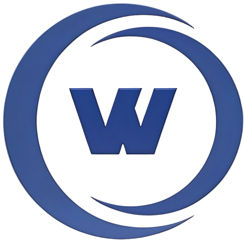

<h1 align="center">Projetos utilizando Python e Django</h1>
 
<!--Banner session-->

  

 

  <!-- Django -->
  
  <!-- Python -->
  <a href="https://github.com/wesllanSilva/python-4d4p/tree/main/Python/Controle_Financeiro">
    

 

Clique no logotipo da linguagem ou framework para conferir soluções que ainda não estão listadas abaixo:

<!-- Python -->

    
<strong>Python Puro</strong>

     
    

        <!-- Projetos com Python Puro -->
        <table border=1>
            <tr>
                <th colspan="3"><a href="https://github.com/wesllanSilva/python-4d4p/tree/main/Python/Controle_Financeiro">Projetos sem framework web</a></th>
            </tr>
            <tr>
                <th colspan="3"> Python</th>
            </tr>
            <tr>
                <th>Projeto</th>
                <th>Solução</th>
                <th>Status</th>
            </tr>
            <tr>
                <td>Sistema de Controle financeiro com Python</td>
                <td><a href="https://github.com/wesllanSilva/python-4d4p/blob/main/Python/Controle_Financeiro/README.md">Código</a></td>
                <td align="center">✔️</td>
            </tr>
            <tr>
                <td>Testes Com Python</td>
                <td><a href="https://github.com/wesllanSilva/python-4d4p/blob/main/Python/Teste/README.md">Código</a></td>
                <td align="center">✔️</td>
            </tr>                
        </table>                   
    

<!-- Django -->

    
<strong>Django</strong>

     
    

        <!-- Projetos com Django -->
        <table border=1>
            <tr>
                <th colspan="3"><a href="https://github.com/wesllanSilva/python-4d4p/tree/main/Django">Projetos fullstack</a></th>
            </tr>
            <tr>
                <th colspan="3"> Django</th>
            </tr>
            <tr>
                <th>Projeto</th>
                <th>Solução</th>
                <th>Status</th>
            </tr>
            <tr>
                <td>Sistema Psicologo</td>
                <td><a href="https://github.com/wesllanSilva/python-4d4p/tree/main/Django/README.md">Código</a></td>
                <td align="center"></td>
            </tr>
            <tr>
                <td>Testes Com Django</td>
                <td><a href="https://github.com/wesllanSilva/python-4d4p/blob/main/Python/Teste/README.md">Código</a></td>
                <td align="center"></td>
            </tr>                
        </table>                   
    

## 🐛 Issues

Sinta-se à vontade para registrar um novo problema com o respectivo título e descrição no repositório do projeto. Se você já encontrou uma solução para seu problema, adoraria revisar sua solicitação de pull!

## 🤝 Contribuições

Siga os passos abaixo para contribuir:

1. Faça o *fork* do projeto (<https://github.com/wesllanSilva/python-4d4p.git>)

2. Clone o seu *fork* para sua maquína (`git clone https://github.com/user_name/python-4d4p.git`)

3. Crie uma *branch* para realizar sua modificação (`git checkout -b feature/name_new_feature`)

4. Adicione suas modificações e faça o *commit* (`git commit -m "Descreva sua modificação"`)

5. *Push* (`git push origin feature/name_new_feature`)

6. Crie um novo *Pull Request*

7. Pronto, agora só aguardar a análise 🚀 

## 📜 License

O projeto lançado em 2020 sobre a licença [MIT](./LICENSE) ❤️ 

Made with ♥ by Wesllan Silva

Gostou? Deixe uma estrelinha para ajudar o projeto ⭐
